# LearnTrack

A console-based Learning Management System built with Java. It allows managing students, courses, and enrollments through an interactive menu-driven interface.

## Features

- **Student Management** – Add, view, search, and deactivate students
- **Course Management** – Add, view, activate, and deactivate courses
- **Enrollment Management** – Enroll students in courses, view enrollments, mark as completed/cancelled

## Project Structure

```
src/com/airtribe/learntrack/
├── Main.java                  # Entry point with menu logic
├── constants/MenuOptions.java # Menu option constants
├── entity/                    # Data models (Person, Student, Course, Enrollment)
├── enums/EnrollmentStatus.java
├── exception/EntityNotFoundException.java
├── repository/                # In-memory data storage
├── service/                   # Business logic layer
└── util/                      # Utilities (IdGenerator, InputValidator)
```

## How to Compile and Run

### Prerequisites
- Java JDK 8 or higher

### Compile

```bash
cd LearnTrack
javac -d out src/com/airtribe/learntrack/**/*.java src/com/airtribe/learntrack/Main.java
```

Or compile all Java files at once:

```bash
javac -d out -sourcepath src src/com/airtribe/learntrack/Main.java
```

### Run

```bash
java -cp out com.airtribe.learntrack.Main
```

## Usage

On running, you'll see the main menu:

```
Menu
====================
1. Student management
2. Course management
3. Enrollment management
4. Exit
Please select an option :
```

Select an option by entering the corresponding number.

## Class Diagram

```mermaid
classDiagram
    class Person {
        -int id
        -String firstName
        -String lastName
        -String email
        +getId() int
        +setId(int)
        +getFirstName() String
        +setFirstName(String)
        +getLastName() String
        +setLastName(String)
        +getEmail() String
        +setEmail(String)
    }

    class Student {
        -String batch
        -boolean active
        +getBatch() String
        +setBatch(String)
        +isActive() boolean
        +setActive(boolean)
        +getDisplayName() String
    }

    class Trainer {
        -String specialization
        +getSpecialization() String
        +setSpecialization(String)
    }

    class Course {
        -int id
        -String courseName
        -String description
        -int durationInWeeks
        -boolean active
        +getId() int
        +setId(int)
        +getCourseName() String
        +setCourseName(String)
        +getDescription() String
        +setDescription(String)
        +getDurationInWeeks() int
        +setDurationInWeeks(int)
        +isActive() boolean
        +setActive(boolean)
    }

    class Enrollment {
        -int id
        -int studentId
        -int courseId
        -Date enrollmentDate
        -EnrollmentStatus status
        +getId() int
        +setId(int)
        +getStudentId() int
        +getCourseId() int
        +getEnrollmentDate() Date
        +getStatus() EnrollmentStatus
        +setStatus(EnrollmentStatus)
    }

    class EnrollmentStatus {
        <<enumeration>>
        ACTIVE
        COMPLETED
        CANCELLED
    }

    class StudentRepository {
        -ArrayList~Student~ students
        +addStudent(Student)
        +getStudents() ArrayList~Student~
    }

    class CourseRepository {
        -ArrayList~Course~ courses
        +addCourse(Course)
        +getCourses() ArrayList~Course~
    }

    class EnrollmentRepository {
        -ArrayList~Enrollment~ enrollments
        +addEnrollment(Enrollment)
        +getEnrollments() ArrayList~Enrollment~
    }

    class StudentService {
        -StudentRepository studentRepository
        -Scanner scanner
        +addStudent()
        +viewAllStudent()
        +searchStudent()
        +deactivateStudent()
    }

    class CourseService {
        -CourseRepository courseRepository
        -Scanner scanner
        +addCourse()
        +viewAllCourses()
        +activateCourse()
        +deactivateCourse()
    }

    class EnrollmentService {
        -EnrollmentRepository enrollmentRepository
        -Scanner scanner
        +enrollStudent()
        +viewEnrollmentsByStudent()
        +markEnrollmentCompleted()
        +markEnrollmentCancelled()
    }

    class IdGenerator {
        -static int studentIdCounter$
        -static int courseIdCounter$
        -static int enrollmentIdCounter$
        +getNextStudentId()$ int
        +getNextCourseId()$ int
        +getNextEnrollmentId()$ int
    }

    class InputValidator {
        +validateMenuOption(String)$ int
    }

    class MenuOptions {
        +STUDENT_MANAGEMENT$ int
        +COURSE_MANAGEMENT$ int
        +ENROLLMENT_MANAGEMENT$ int
        +EXIT$ int
    }

    class EntityNotFoundException {
        +EntityNotFoundException(String)
    }

    Person <|-- Student
    Person <|-- Trainer
    Enrollment --> EnrollmentStatus
    StudentService --> StudentRepository
    CourseService --> CourseRepository
    EnrollmentService --> EnrollmentRepository
    StudentService ..> IdGenerator
    CourseService ..> IdGenerator
    EnrollmentService ..> IdGenerator
    StudentService ..> EntityNotFoundException
    CourseService ..> EntityNotFoundException
    EnrollmentService ..> EntityNotFoundException
    Main ..> StudentService
    Main ..> CourseService
    Main ..> EnrollmentService
    Main ..> InputValidator
    Main ..> MenuOptions
```


